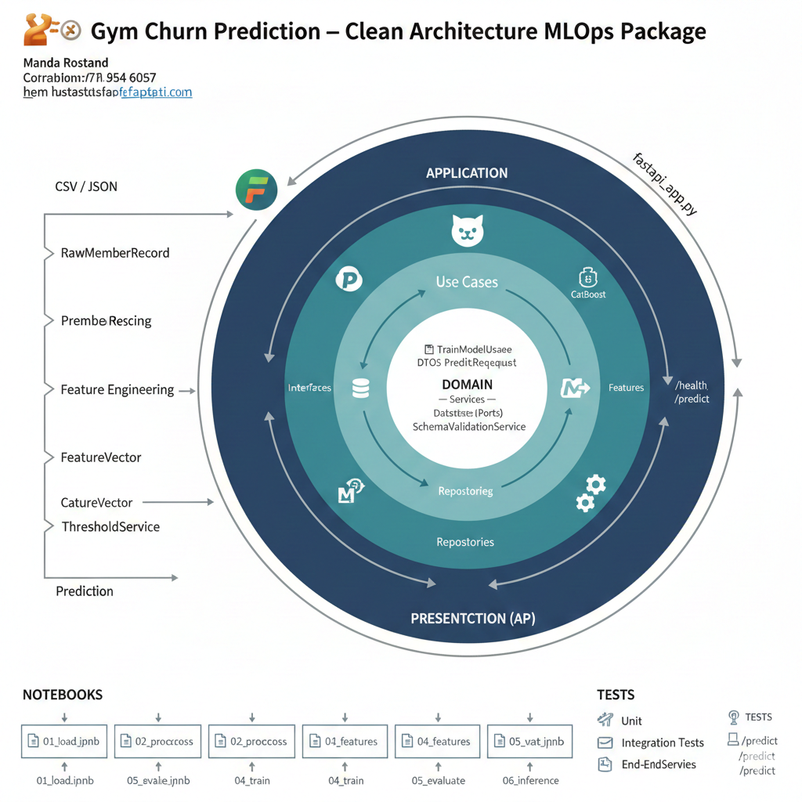

---

# 🏋️‍♂️ Gym Churn Prediction — Clean Architecture MLOps Package

- **Auteur :** Manda Rostand
- **Contact :** [rostandsurel@yahoo.com](mailto:rostandsurel@yahoo.com)
- **GitHub :** [https://github.com/Manda404](https://github.com/Manda404)

---

## 📌 Présentation du projet

Ce projet a pour objectif de **concevoir un package de Machine Learning prêt pour la production**, permettant de **prédire le churn (résiliation)** de membres de salle de sport à partir de données comportementales, démographiques et temporelles.

Au-delà de la performance du modèle, l’enjeu principal du projet est **l’architecture logicielle** :

> 👉 **Comment concevoir un projet ML propre, maintenable, testable et déployable en production**, en s’inspirant strictement des principes de la **Clean Architecture**.

Le projet aboutit à :

* un **package Python structuré**
* un **pipeline ML reproductible**
* une **API FastAPI déployable (Docker / Kubernetes)**
* une séparation claire entre **métier, orchestration, infrastructure et exposition API**

<p align="center">
  
</p>
---

## 🎯 Problématique métier

Dans le contexte des salles de sport :

* le churn est coûteux,
* il est souvent précédé de signaux faibles (baisse de visites, inactivité, changement de comportement).

L’objectif est donc de :

* estimer une **probabilité de churn**
* fournir un **label binaire**
* associer un **niveau de risque métier** (low / medium / high)
  afin d’aider les équipes à **prioriser les actions de rétention**.

---

## 🧠 Philosophie du projet

Ce projet **n’est pas un simple notebook de data science**.

Les principes fondateurs sont :

* 🔹 **Clean Architecture** avant tout
* 🔹 Séparation stricte des responsabilités
* 🔹 Même pipeline en training et en inference (pas de skew)
* 🔹 Aucun code ML dans l’API
* 🔹 Modèle remplaçable sans casser l’application
* 🔹 Projet pensé dès le départ pour la production

---

## 🏗️ Architecture globale

Le pipeline complet est le suivant :

```text
CSV / JSON
   ↓
RawMemberRecord
   ↓
Preprocessing (robuste, typage, NaN-safe)
   ↓
MemberRecord
   ↓
Feature Engineering métier
   ↓
FeatureVector
   ↓
CatBoost (probabilités)
   ↓
ThresholdService (règle métier)
   ↓
Prediction (proba, label, risk_level)
```

---

## 📂 Structure du projet

```text
churn_gym_mlops/
├── src/churn_gym/
│   ├── domain/              # Entités métier & règles business
│   │   ├── entities/
│   │   ├── interfaces/
│   │   └── services/
│   ├── application/         # Use cases (orchestration)
│   │   └── use_cases/
│   ├── infrastructure/      # Implémentations techniques
│   │   └── ml/
│   └── presentation/        # API FastAPI
│       └── api/
├── notebooks/               # Exécution pas à pas (EDA, preprocessing, training)
├── tests/                   # Tests unitaires et e2e
├── artifacts/               # Modèles entraînés
├── pyproject.toml
└── README.md
```

---

## 🧩 Couches Clean Architecture

### 🔹 Domain

* Entités métier (`MemberRecord`, `FeatureVector`, `Prediction`)
* Services métier (`ThresholdService`)
* Interfaces abstraites (ports)

➡️ **Aucune dépendance technique**

---

### 🔹 Application

* Use cases (`PreprocessDatasetUseCase`, `BuildFeaturesUseCase`, `TrainModelUseCase`, `PredictUseCase`)
* Orchestration du flux de données

➡️ **Aucune dépendance ML concrète**

---

### 🔹 Infrastructure

* Pandas, CatBoost
* Feature engineering
* Preprocessing robuste
* Chargement/sauvegarde du modèle

➡️ **Remplaçable sans impacter le domaine**

---

### 🔹 Presentation (API)

* FastAPI
* Endpoints `/health` et `/predict`
* Aucune logique ML ou métier

➡️ **API légère, stateless et scalable**

---

## 🔬 Feature Engineering (métier)

Le feature engineering n’est **pas générique**, il est **métier** :

* `tenure_days`
* `days_since_last_visit`
* `tenure_bucket`
* `visit_recency_bucket`
* `calories_per_minute`
* `weight_per_visit`

Les variables catégorielles sont conservées **sans encodage**, afin de tirer parti des capacités natives de **CatBoost**.

---

## 🤖 Modèle ML

* **CatBoostClassifier**
* Gestion native des variables catégorielles
* Target binaire `0 / 1`
* Sortie probabiliste

Le modèle ne prend **aucune décision métier** :

* il fournit uniquement une **probabilité**

---

## ⚖️ Décision métier (ThresholdService)

La conversion :

```text
probabilité → label → niveau de risque
```

est gérée par un **service métier dédié** :

* seuil configurable
* traçabilité du seuil utilisé
* séparation claire entre ML et règles business

Cela permet :

* des A/B tests
* des ajustements métier sans réentraîner le modèle
* une gouvernance claire

---

## 🚀 API FastAPI

### Endpoints principaux

* `GET /health`
  → supervision & readiness (Kubernetes-friendly)

* `POST /predict`
  → prédiction batch avec :

  * probabilité de churn
  * label binaire
  * niveau de risque
  * seuil utilisé

L’API est :

* stateless
* Docker-ready
* Kubernetes-ready

---

## 📒 Notebooks

Les notebooks servent uniquement à :

* exécuter les étapes
* inspecter les données
* entraîner le modèle

Ils **n’hébergent aucune logique métier**.

---

## 🧪 Tests (à venir / extensibles)

* tests unitaires domaine
* tests des use cases
* tests e2e API

---

## 🧠 À qui s’adresse ce projet ?

* Data Scientists souhaitant **industrialiser** leurs modèles
* ML Engineers
* Étudiants voulant comprendre la **Clean Architecture appliquée au ML**
* Recruteurs cherchant un **projet ML production-grade**

---

## 🏁 Conclusion

Ce projet illustre qu’un projet de Machine Learning peut (et doit) être :

* lisible
* maintenable
* testable
* scalable
* orienté production

👉 **La performance du modèle est importante, mais l’architecture l’est encore plus.**

---